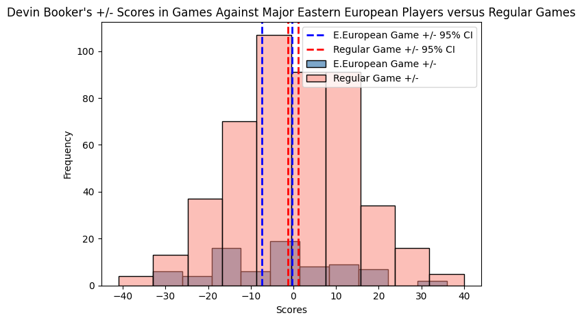

# Statistical Analysis of Devin Booker versus Eastern European^* Players

** Introduction: ** 
It is accepted as common knowledge within the r/nbacirclejerk community that Eastern European NBA Players such as Nikola Jokić and Luka Dončić are Devin Booker's, 'Father' but would a rigorous statistical analysis of Devin Booker's +/- scores yield the same result? In this report we will find out: is there a statistically significant difference in the +/- performance of Devin Booker against NBA teams with Eastern European Players and NBA teams without Eastern European Players.

also im drunk rn if i mess up something dont get mad

** Definition and List of Eastern European Players Chosen **

First we have to provide a  definition of what constitutes a “Eastern European Country”. According to the EuroVoc’s defines Eastern Europe includes Serbia, Slovenia, Montenegro, Lithuania, Croatia, LAavia. It may cause some irritation to Europeans, in that some may claim some these countries belong to 'Central Europe'. Admittaly, it may be more accurate to say this is an analysis of Devin Booker versus Eastern (and Central^* ) European countries, but I don't really care.

We now need to list the Eastern European Players. I have chosen to focus on 6 main Eastern (and Central) European NBA players that have been active in Devin Booker's lackluster career. These players include:
	- Nikola Jović (Serbia)
	- Luka Dončić (Slovenia)
	- Nikola Vučević (Montenegro)
	- Domantas Sabonis (Lithuania)
	- Bojan Bogdanović (Croatia)
	- Kristaps Porziņģis (Latvia)

If I forgot someone it's either because they weren't relevant enough or I'm retarded.

Finally, we should discuss the metric used to verify the quality of Devin Booker's bbal skillz. The chosen metric is +/- which is a metric that "reflects how the team did while that player is on the court", or more specifically reflects the number of points a player outscores an opponent while they are on the court (i.e. If a player has a +5 PM, it means his team outscored the opponent by 5 points while he was on the court). Or if you're too dumb: bigger +/- number means better player. A good +/- is like 3-6. Btw Booker's career average +/- is almost excatly 0 which according to the expert [jerkers](https://www.basketball-reference.com/about/bpm2.html): "+0.0 is a decent starter or solid 6th man".

** Null and Alternative Hypothesis: **
We will now formally define the Null and Alternative Hypothesis:

Null Hypothesis  H_0 : μ_0 = μ_a 
Alternative Hypothesis  H_a : μ_0 > μ_a

(Where μ_0 represents Devin Booker's mean +/- against teams without the highlighted European Players, and μ_a represents his  mean +/- against teams with the highlighted European Players.)

** Methods:  **
Devin Booker's +/- stats per game was obtained through [basketball reference website](https://www.basketball-reference.com/players/b/bookede01.html). Then I noted the games Devin Booker played against the listed Europeans and created a euro_score and non_euro score dataset containing Booker's respective +/- stats for the two groups.

** Analysis and Results: **

Creating a 95% Confidence interval Devin Booker's two group of +/- scores we see: 

Devin Booker's 95% Confidence interval +/- scores against Eastern European Players: [-7.34, -0.25] 
Devin Booker's 95% Confidence interval +/- scores against other Teams: [-1.33, 1.17]

And performing a two-sample t-test yields a p-value of 0.03224 which is less than or equal to 0.05.
We can interpret this as: there is a significant difference between  Devin Booker's +/- scores against teams with major Eastern European players. This means that we can conclude that there is a statistical difference in +/- score and equivalentlly performance of Devin Booker when there Booker is facing a Eastern European Player.

** Conclusion / TLDR / the "Im not reading that" secion: **
Yeah I bet you didn't read that and just want the results huh.

Well the main conclusion: DEVIN BOOKER STATISTICALLY PLAYS WORSE WHEN PLAYING EASTERN EUROPEAN NBA PLAYERS CONFIRMING THAT EASTERN EUROPE IS INDEED DEVIN BOOKERS FATHER

pls someone give me an internship im tired of being a bum

